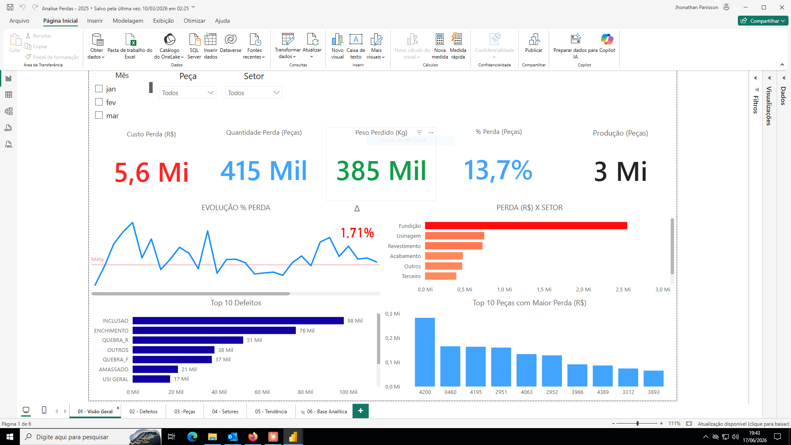
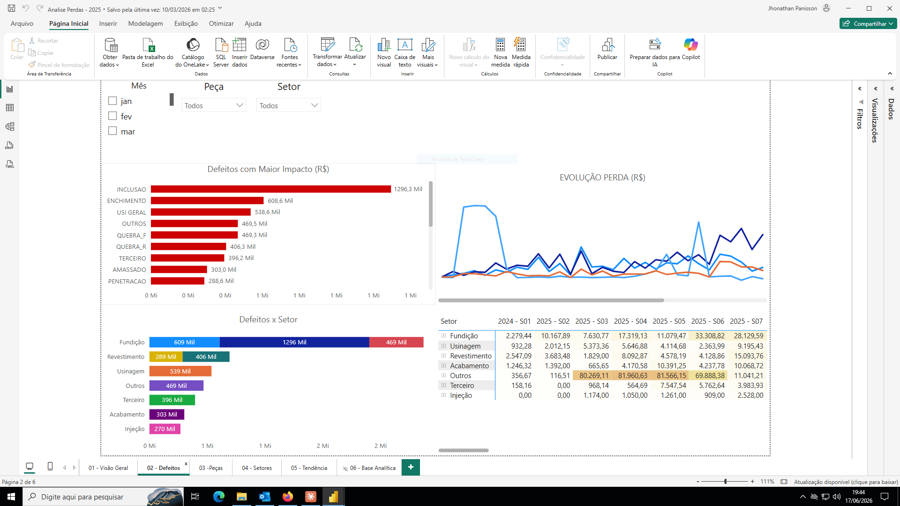
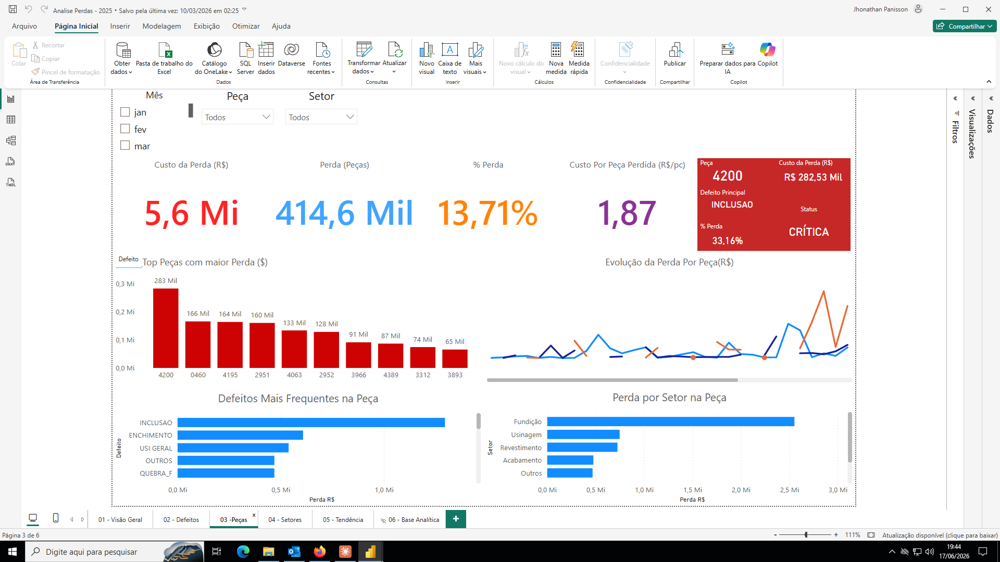
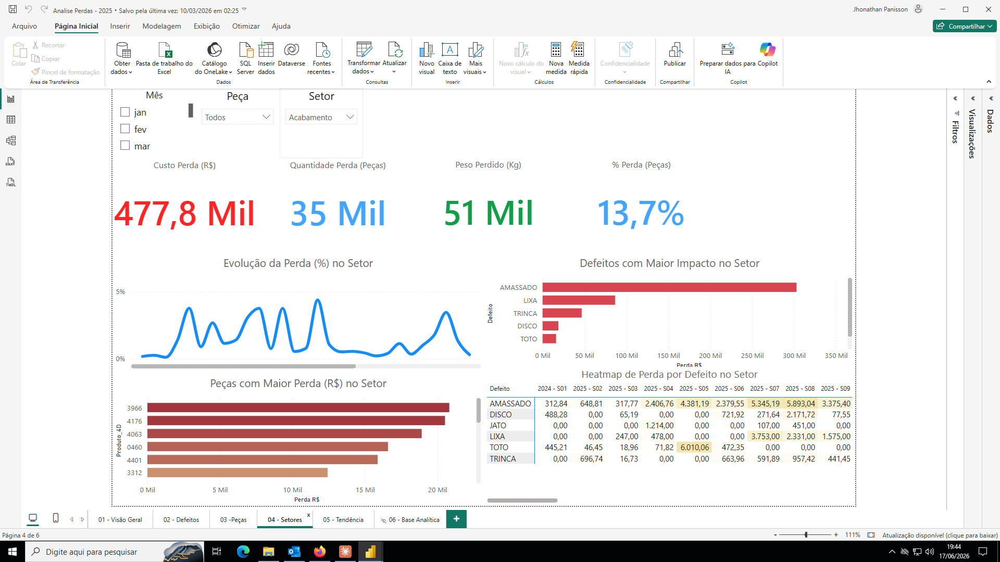
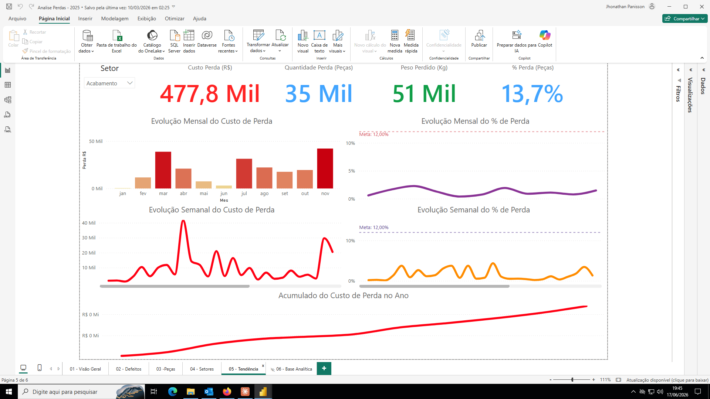

# 📊 Análise de Perdas na Produção Industrial — Power BI

## Visão Geral

Dashboard desenvolvido por iniciativa própria para monitoramento e análise de perdas 
no processo produtivo de uma indústria de microfusão. O projeto cobre 6 visões 
analíticas distintas e monitora um volume de perdas na ordem de R$ 5,6 milhões anuais.

Todos os dados são originados de relatórios gerados pelo ERP Protheus (CSV), 
tratados via Power Query e modelados no Power BI Desktop.

---

## 🎯 Objetivo

Substituir controles manuais em planilhas por um painel interativo e dinâmico, 
permitindo à liderança e gestão:

- Monitorar o % de perda em tempo real por setor, peça e defeito
- Identificar os principais causadores de refugo e seu impacto financeiro
- Acompanhar tendências semanais e mensais com linha de meta
- Priorizar ações corretivas com base em dados

---

## 📁 Estrutura do Relatório

| Aba | Conteúdo |
|-----|----------|
| 01 - Visão Geral | KPIs principais, Top 10 defeitos, Perda por setor |
| 02 - Defeitos | Defeitos com maior impacto financeiro, evolução e heatmap |
| 03 - Peças | Análise por peça com KPI dinâmico de status (CRÍTICA/NORMAL) |
| 04 - Setores | Drill-down por setor com heatmap de defeito x semana |
| 05 - Tendência | Evolução mensal, semanal e acumulado anual com linha de meta |
| 06 - Base Analítica | Tabela detalhada para análise livre |

---

## 📌 KPIs Monitorados

- **Custo da Perda (R$)** — Total financeiro de peças refugadas
- **Quantidade Perdida (Peças)** — Volume absoluto de refugo
- **Peso Perdido (Kg)** — Impacto em peso de material desperdiçado
- **% de Perda** — Indicador percentual com linha de meta (12%)
- **Produção Total (Peças)** — Referência de volume produzido

---

## 🔍 Destaques Técnicos

- **KPI dinâmico de status por peça** — muda de cor automaticamente 
  (CRÍTICA / ATENÇÃO / NORMAL) com base no % de perda da peça selecionada
- **Filtros interativos** por Mês, Peça e Setor com atualização em cascata
- **Heatmap** de perda por defeito e semana por setor
- **Linha de meta** nas visões de tendência (% Perda — Meta: 12%)
- **Fonte de dados:** ERP Protheus → CSV → Excel → Power Query → Power BI

---

## 🛠️ Tecnologias Utilizadas

- Power BI Desktop
- Power Query (ETL e tratamento de dados)
- DAX (medidas, KPIs, formatação condicional dinâmica)
- ERP Protheus (fonte de dados)
- Microsoft Excel (camada intermediária)

---

## 📸 Screenshots

### Visão Geral

### Análise de Defeitos

### Análise por Peça com KPI Dinâmico

### Análise por Setor com Heatmap

### Tendência e Acumulado

---

## 👤 Autor

**Jhonathan Panisson**  
Líder de Produção | Analista de Dados em Transição  
[LinkedIn](https://linkedin.com/in/seu-perfil) | [GitHub](https://github.com/seu-usuario)
